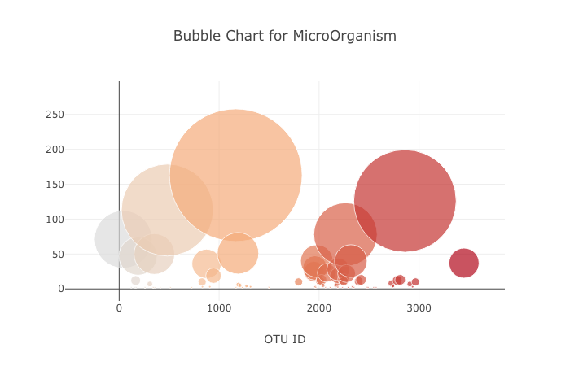
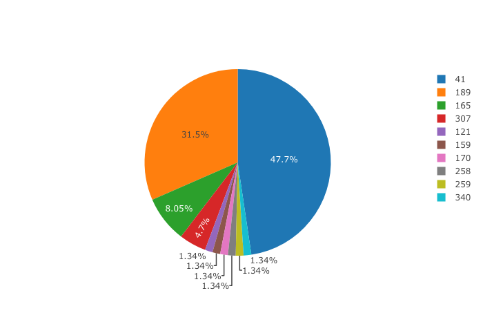

# MicroDiversity


This project is focusing on creating a visualization from the provided data and deploying the website onto Heroku.
The project can be seen at https://micro-diversity.herokuapp.com/ 

## Getting Started
The following programs and the information are required on your local machine. 
### Required program
* SQLAlchemy
* Pandas
* Numpy
* D3.js

### Available Resources
* belly_button_data.csv
* belly_button_metadata.csv

### Starting Code
* app.py
* app.js
* index.html

## Project Breakdown
### Making the Bubble Chart
Use d3.json to obtained the data for the visualization then assigned them to the variable called trace1. 

```d3.json(chartData).then(function(data){}```

Trace1 contained all of the required information for the chart. 

```var trace1 = {}```

The structure of this visualization is a scatter plot with the size of the dot representing the population of the micro-organism. 



### Making the Pie Chart
Similarly to the Bubble Chart, with different labels in the plotting variable. In this case, I assigned them onto the variable called pieData 

```var pieData = [{}]```



### Deploy the website using Heroku
Multiple steps are required to load and deploy the website

* Prepare the procfile and the requirement.txt 

```conda create [your own environment]```

* Install the following program onto your local machine

```pip install gunicorn```

```pip install psycopg2```

```pip install flask```

```pip install flask-sqlalchemy```

```pip install pandas```

* run the app using flask

```FLASK_APP= [yours] flask run```

* Login to the Heroku account

```heroku login```

* clone the repository to your local machine

```heroku git:clone -a micro-diversity```

```cd micro-diversity```

* Deploy all of the contents

```git add .```

```git commit -m " "```

```git push heroku master```

* Load the webpage content and other necessary contents required for the webpage onto Heroku, micro-diversity. 

https://micro-diversity.herokuapp.com/ 

## Author
Yanin Swangrujithum 


